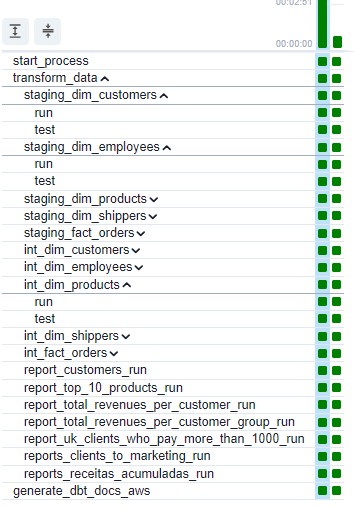
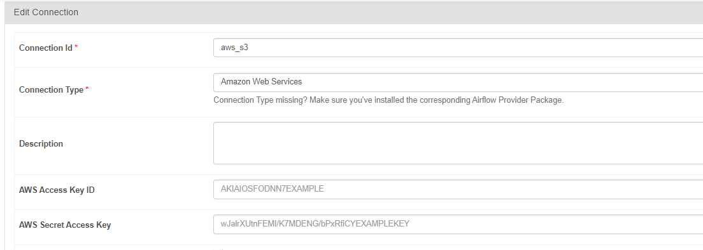

## northwind-airflow-dbt

#### O projeto envolve a criação de uma solução de processamento de dados usando o Airflow e o DBT. Utilizamos o dbt-core processando os dados de um banco de dados Postgres criado usando o Docker. A orquestração dos modelos do DBT foi realizada usando o plugin do Cosmos. 

#### Por fim, foi gerada a documentação do DBT criando um site estático usando o S3.
http://dbt-docs-datalake.s3-website.us-east-2.amazonaws.com/#!/overview

#### Documentação de referência para hospedar um site estático usando o S3.
https://medium.com/@chibuokejuliet/hosting-dbt-documentation-site-on-aws-s3-bucket-00aa524f331f

#### Repositório contendo os modelos do DBT.

https://github.com/brunclopes-lab/dbt-northwind-rds

### Como executar o projeto

#### Clonar o repositório, executar o comando "init_project.sh" e após o levantamento dos recursos, criar as conexões com o S3 e com o PostgreSQL. A conexão com o S3 deverá ter o nome chamado "aws_s3", e a conexão com o Postgres deverá ter o nome "postgres_northwind_conn". Caso mude o nome deverá também ser alterado na DAG. 

#### Exemplo de conexão com o S3, bsata preencher o access e secret key. 

#### Exemplo de conexão com o Postgres local. O host está definido no docker compose db. 
 
