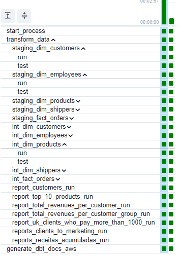

## northwind-airflow-dbt

#### O projeto envolve a criação de uma solução de processamento de dados usando o Airflow e o DBT.
#### Utilizamos o dbt-core processando os dados de um banco de dados Postgres criado usando o Docker. 
#### A orquestração dos modelos do DBT foi realizada usando o plugin do Cosmos. 

#### Por fim, foi gerada a documentação do DBT criando um site estático usando o S3.
http://dbt-docs-datalake.s3-website.us-east-2.amazonaws.com/#!/overview

#### Documentação de referência para hospedar um site estático usando o S3.
https://medium.com/@chibuokejuliet/hosting-dbt-documentation-site-on-aws-s3-bucket-00aa524f331f

